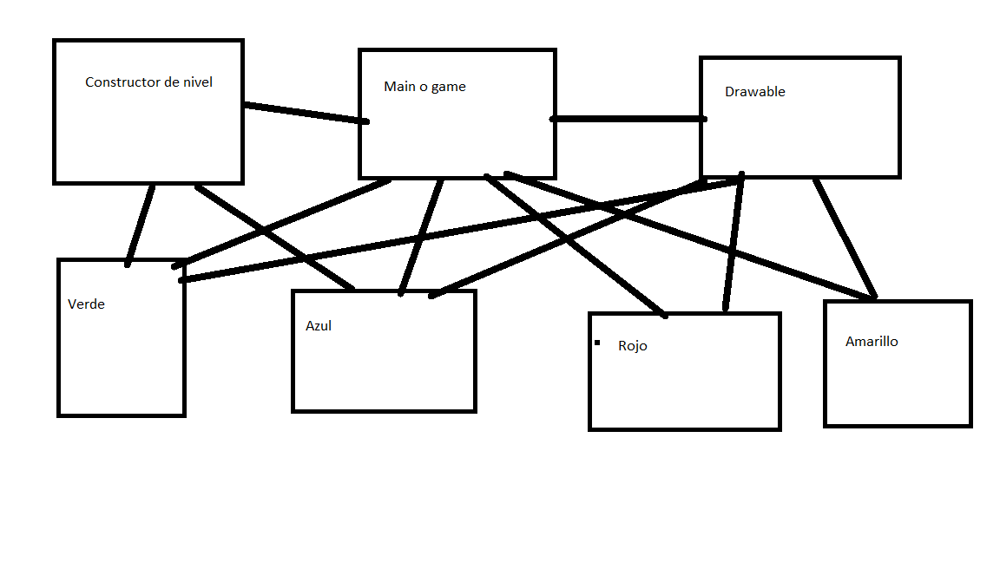

## SimonTEC

● Historias de usuario identificadas del problema propuesto
[Link](https://github.com/AxelJCM/TareaCortaDatos1/projects/3)
● Clasificación según criticidad y frecuencia de uso

● Minimal system span/● Plan de iteraciones
[link](https://github.com/AxelJCM/TareaCortaDatos1/projects/4)

● Diagrama conceptual (donde se muestre a alto nivel la solución planteada)

● Diagrama de clases a nivel de implementación (incluyendo tipos de datos)

